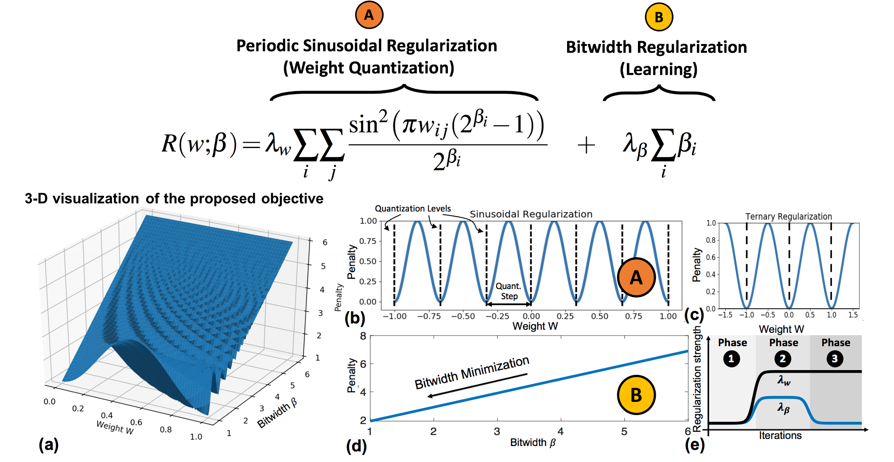

# WaveQ: Gradient-Based Deep Quantization of Neural Networks through Sinusoidal Adaptive Regularization

# Instructions

## Example Usage:

$ cd code/examples/classifier_compression

$ python3 compress_classifier_waveq_cifar10.py --arch simplenet_cifar ../../../data.cifar --epochs 1000 --lr 0.005

## Hyperparameters:

- Weights quantization regularization strength: lambda_q (first term in the proposed regularization function)

- Bitwidth regularization strength: lambda_f (for the second term in the proposed regularization function)

## Notes:

WaveQ is implemented inside Distiller (Zmora et al., 2018), an open source framework for compression by Intel Nervana.

https://github.com/NervanaSystems/distiller

## Requirements:

- Python3

- Tensorflow

- Pytorch 

- Distiller 

## License:
---------------------------------

-- Work under review and  development --  

